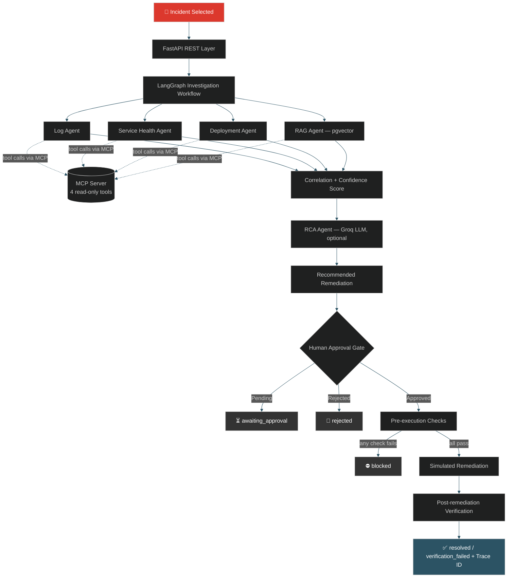

<div align="center">


<a href="https://github.com/Om20An00/AIOPs-Pilot">
  
</a>

<br/>


### 🔗 [**API Docs — http://localhost:8000/docs**](http://localhost:8000/docs) &nbsp;·&nbsp; run it with one command below ⬇️

</div>

---

## 📖 About This Project

An **AI-assisted incident investigation and remediation platform**, built as a learning / portfolio project. Given an incident, specialised agents collect evidence from logs, service health, deployment history and a vector store of past incidents. A correlation step scores root-cause hypotheses, an LLM agent explains the result, and a **human must approve** before any remediation runs.

Instead of *Incident → Engineer → Manual investigation → Guesswork → Fix*, OpsPilot gives you *Incident → Automated investigation → Evidence → Recommendation → Human approval → Remediation → Verification.*

> ⚠️ **Honest scope:** all data (incidents, logs, metrics, deployments, history) is **synthetic**, there are no real users, and every remediation is **simulated** — no real infrastructure is ever touched.

> 🧠 **Author's note:** Built by me as a hands-on deep dive into agentic, evidence-driven operations tooling — LangGraph workflows, pgvector-backed RAG, an MCP tool server, and a human-approval gate. AI assistance was used while building it.

---

## 🏗️ Architecture

<div align="center">



</div>

```text
   MCP       → the app starts mcp_server/server.py as a stdio child process; every agent calls its tools
               through an MCP ClientSession (search_logs, service_health, recent_deployments, search_similar_incidents)
   Postgres  → pgvector table of past incidents (RAG) + investigation results/approval state
```

---

## 📸 Screenshots

<div align="center">

| Incident Queue | Investigation View |
|:---:|:---:|
|  |  |

| Evidence & Confidence Scores | Root Cause & Recommended Action |
|:---:|:---:|
|  |  |

| Approval & Remediation | Verification & Final Report |
|:---:|:---:|
|  |  |

</div>

---

## ✨ Features

| Category | What's Implemented |
|---|---|
| **Agentic Workflow** | Investigation modeled as a **LangGraph** state graph — Log, Service Health, Deployment and RAG agents run in **parallel**, fan in to a correlation step, then the RCA agent, remediation planning and the approval gate |
| **Real RAG** | No TF-IDF shortcuts — 10 historical incidents are embedded with `sentence-transformers/all-MiniLM-L6-v2`, stored as `vector(384)` in **PostgreSQL + pgvector** (HNSW index), and retrieved via cosine distance |
| **Root-Cause Correlation** | Each agent votes for root-cause categories; votes are weighted (logs 0.30 · health 0.25 · deployments 0.20 · RAG 0.25) and summed into explainable hypothesis scores |
| **Confidence Scoring** | Top hypothesis score is the confidence (a transparent heuristic, **not** a calibrated probability). Low confidence requires an explicit acknowledgement to approve |
| **Human-in-the-Loop** | Remediation never runs blindly — every investigation ends in `awaiting_approval` until a named human approves via the API/UI |
| **Automated Checks** | Pre-execution checks (approval recorded, action allow-listed, service known, confidence OK/acknowledged, not already executed) and post-remediation verification (no active anomalies, error rate < 1%, p95 < 500 ms) |
| **LLM Where It's Needed** | Only the **RCA agent** uses an LLM (Groq). It can only choose among the top candidate categories and cite real evidence IDs; invalid output falls back to a rule-based summary |
| **Deterministic Core** | Log analysis, health checks, deployment correlation, vector search and scoring are deterministic. The app runs fully **without** an LLM key (`"llm_used": false`) |
| **MCP Integration** | A real MCP server exposes 4 read-only tools; agents execute them through an MCP client session |
| **Testing** | `pytest` suite (13 tests, no DB/model/API key needed) covering classification, health rules, root cause per incident, approval gate, checks and LLM-output validation |
| **Containerization** | Docker Compose runs the app (with the MCP server as a child process) and a pgvector-enabled PostgreSQL |
| **Observability** | Every investigation gets a unique **trace ID**; every remediation is `"simulated": true` |

---

## 🛠️ Tech Stack

<div align="center">


</div>

LangGraph · MCP Python SDK · Sentence Transformers · pgvector · psycopg · Groq SDK · Pydantic · pytest

---

## 🚀 Getting Started

### Prerequisites

- Docker Desktop / Docker Engine + Compose
- ~4 GB free RAM recommended (the embedding model runs locally on CPU)

### 1. Clone the repository

```bash
git clone https://github.com/Om20An00/AIOPs-Pilot.git
cd AIOPs-Pilot
```

### 2. Build and start everything

```bash
docker compose up --build
```

> 💡 The first build downloads CPU-only PyTorch and bakes the embedding model into the image, so it takes a few minutes. Subsequent runs reuse the cached image, so startup is much faster.

### 3. Open the app

| Service | URL |
|---|---|
| 🖥️ UI | http://localhost:8000 |
| 📖 API Docs (Swagger) | http://localhost:8000/docs |
| ❤️ Health Check | http://localhost:8000/health |
| ✅ Readiness (lists MCP tools, LLM on/off) | http://localhost:8000/ready |

### 4. Run an investigation, then approve it

```bash
curl -X POST http://localhost:8000/api/incidents/INC-1002/investigate

curl -X POST http://localhost:8000/api/incidents/INC-1002/approve \
  -H "Content-Type: application/json" \
  -d '{"approved": true, "approver": "om"}'
```

> If an investigation is flagged `"low_confidence": true`, approval also needs `"acknowledge_low_confidence": true`.

### 5. (Optional) Enable LLM reasoning with Groq

The app runs fully **without** an LLM key (rule-based RCA summary). To enable LLM reasoning in the RCA agent:

```bash
cp .env.example .env
```

```env
GROQ_API_KEY=your_key_here
GROQ_MODEL=llama-3.3-70b-versatile
```

Then `docker compose up --build` again and check that `/ready` shows `"llm_enabled": true`.

> ⚠️ RAG retrieval is **never** optional — it always uses real vector embeddings in pgvector. The LLM only affects the RCA explanation. If the LLM disagrees with the evidence-based category, the evidence wins and confidence is reduced (×0.85).

### 6. Stop everything

```bash
docker compose down
```

---

## 🧰 MCP Server

`mcp_server/server.py` is a small MCP server (FastMCP, **stdio** transport) exposing four read-only tools. The API launches it as a child process at startup and **every agent calls its tools through an MCP `ClientSession`** (`app/mcp_client.py`).

| Tool | Purpose |
|---|---|
| `search_logs` | Return log lines for an incident at or above a level |
| `service_health` | Health metrics for a service (`current` or simulated `post_remediation`) |
| `recent_deployments` | Deployments of a service in the window before an incident |
| `search_similar_incidents` | Semantic search over historical incidents (MiniLM embedding + pgvector cosine similarity) |

---

## 📡 API Reference

| Method | Endpoint | Description |
|---|---|---|
| `GET` | `/api/incidents` | List seeded incidents with their investigation status |
| `POST` | `/api/incidents/{incident_id}/investigate` | Run the full investigation workflow |
| `GET` | `/api/incidents/{incident_id}/investigation` | Fetch the stored investigation |
| `POST` | `/api/incidents/{incident_id}/approve` | Approve/reject; on approval runs pre-checks → simulated remediation → post-remediation verification |
| `GET` | `/health` / `/ready` | Health & readiness probes |

**Example response** (`/investigate`, abridged — scores vary slightly with the embedding model)

```json
{
  "incident": { "id": "INC-1002", "service": "payment-service", "severity": "SEV1" },
  "trace_id": "4012bc1e-f261-4c16-a103-2e9eea8b1561",
  "evidence": [
    { "id": "logs", "summary": "6 ERROR lines; dominant pattern: bad_deployment (100% of errors)." },
    { "id": "health", "summary": "Anomalous metrics: error_rate_pct=63.0, p95_latency_ms=1800, pod_restarts=14." },
    { "id": "deployments", "summary": "v3.2.1 deployed 10 min before the incident." },
    { "id": "rag", "summary": "Most similar past incident PI-003 (bad_deployment, ...)." }
  ],
  "hypotheses": [{ "category": "bad_deployment", "score": 0.82 }],
  "root_cause": { "category": "bad_deployment", "llm_used": false },
  "confidence": 0.82,
  "remediation_plan": { "action": "rollback_deployment", "rollback_to": "v3.2.0", "simulated": true },
  "status": "awaiting_approval",
  "low_confidence": false
}
```

---

## 🌱 Seed Data

**5 synthetic incidents** to investigate (one per root-cause category) and **10 synthetic historical incidents** embedded into pgvector for RAG:

<details>
<summary>Click to expand incident categories</summary>

<br/>

| Incident | Service | Scenario | Expected root cause |
|---|---|---|---|
| INC-1001 | order-service | Orders failing with 503, DB connections unavailable (after a release) | `db_pool_exhaustion` (release flagged as contributing factor) |
| INC-1002 | payment-service | 500s and crash-loops right after a release | `bad_deployment` |
| INC-1003 | cart-service | Slow carts, vanishing items, cache memory full | `cache_degradation` |
| INC-1004 | checkout-service | Shipping quote step timing out on an external API | `upstream_dependency` |
| INC-1005 | auth-service | Login failing with TLS errors | `certificate_expiry` |

Historical knowledge base: 2 past incidents per category (`PI-001` … `PI-010`) with root cause and resolution.

</details>

---

## 🧪 Running Tests

```bash
# locally (no DB, model or API key needed)
pip install -r requirements.txt
pytest -q

# or inside the running container
docker compose exec app pytest -q
```

---

## ⚠️ Limitations

- Data is synthetic; only 5 failure categories are modeled
- Confidence is a weighted-vote heuristic, not a calibrated probability; the RAG similarity thresholds are heuristics tuned for MiniLM
- Remediations are simulated and "post-remediation" metrics come from seeded data
- The MCP server runs as a stdio child process of the API (fine for a demo; a service in production)
- No authentication on the API — `approver` is a free-text name

---

## 🔮 Roadmap / Future Enhancements

- [ ] Real monitoring/log integrations (Prometheus, Loki)
- [ ] RBAC / OIDC authentication on `/approve` + audit log
- [ ] LangGraph checkpointer for resumable runs
- [ ] Evaluation set to measure RCA accuracy
- [ ] Async job queue for long investigations
- [ ] Kubernetes tool adapter
- [ ] OpenTelemetry traces/metrics

---

## 🍴 Forking & Cloning

This repository is open for learning purposes. If you'd like to explore, run, or build on top of it:

```bash
# Clone directly
git clone https://github.com/Om20An00/AIOPs-Pilot.git

# Or fork it via the GitHub UI (top-right "Fork" button) to make your own copy
```

If you fork this project or use it as a reference/base for your own work, a ⭐ star or a mention/credit back to this repo is appreciated but not required. Pull requests with genuine improvements are welcome — please open an issue first to discuss what you'd like to change.

---

## 👤 Author

**Om** — [@Om20An00](https://github.com/Om20An00)

A hands-on, independent portfolio project exploring agentic workflows, RAG and MCP. AI assistance was used while building it.

<div align="center">

If this project helped you or you found it interesting, consider giving it a ⭐!


</div>